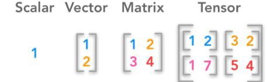
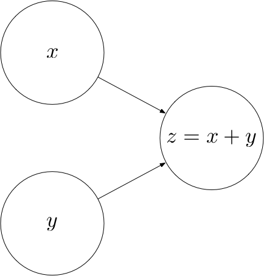

# computational graphs

A computational graph is a directed graph where the nodes correspond to **operations** or **variables**. **Variables** can feed their value into **operations**, and **operations** can feed their **output** into other **operations**. This way, every node in the graph defines a function of the variables.

The values that are fed into the nodes and come out of the nodes are called **tensors**.

**Sub - QA**: Diff between scalar, Vector, Matrix and Tensor?



$$ \text{Let’s look at an example. The following computational graph computes the sum z of two inputs x and y. Here, x and y are input nodes to z and z is a consumer of x and y. z therefore defines a function} z : \mathbb{R^2} \rightarrow \mathbb{R}. $$



## Operations:

Every operation is characterized by three things:

* A compute function that computes the operation's output given values for the operation's inputs
* A list of input_nodes which can be variables or other operations
* A list of consumers that use the operation's output as their input

```python
class Operation:
    """Represents a graph node that performs a computation
    An `Operation` is a node in a `Graph` that takes zero or
    more objects as input, and produces zero or more objects
    as output.
    """
    def __init__(self, input_nodes = []):
        """Construct Operation
        """
        self.input_nodes = input_nodes
        # Initialize list of consumers (i.e. nodes that receive this operation's output as input)
        self.consumers = []
        # Append this operation to the list of consumers of all input nodes
        for input_node in input_nodes:
            input_node.consumers.append(self)
        # Append this operation to the list of operations in the currently active default graph
        _default_graph.operations.append(self)
  
    def compute(self):
        """Computes the output of this operation.
        "" Must be implemented by the particular operation.
        """
        pass
```

```Python
class add(Operation):
    """Returns x + y element-wise.
    """
    def __init__(self, x, y):
        """Construct add
        Args:
          x: First summand node
          y: Second summand node
        """
        print("add__init__");
        super(add, self).__init__([x, y])

    def compute(self, x_value, y_value):
        """Compute the output of the add operation
        Args:
          x_value: First summand value
          y_value: Second summand value
        """
        print("add.compute");
        print("x_value", x_value);
        print("y_value", y_value);
        self.inputs = [x_value, y_value]
        return x_value + y_value

```

```python
class matmul(Operation):
    """Multiplies matrix a by matrix b, producing a * b.
    """
    def __init__(self, a, b):
        """Construct matmul
        Args:
          a: First matrix
          b: Second matrix
        """
        print("matmul__init__");
        #super().__init__([a, b])
        #super().__init__(a, b)
        super(matmul, self).__init__([a, b])
    def compute(self, a_value, b_value):
        """Compute the output of the matmul operation
        Args:
          a_value: First matrix value
          b_value: Second matrix value
        """
        print("matmul.compute");
        print("a_value", a_value);
        print("b_value", b_value);
        self.inputs = [a_value, b_value]
        return a_value.dot(b_value)
```

### Placeholder and variable

Not all the nodes in a computational graph are operations. For example, in the affine transformation graph, 𝐴, 𝑥 and 𝑏 are not operations. Rather, they are inputs to the graph that have to be supplied with a value once we want to compute the output of the graph. To provide such values, we introduce placeholders.

```python
class placeholder:
    """Represents a placeholder node that has to be provided with a value
       when computing the output of a computational graph
    """
    def __init__(self):
        """Construct placeholder
        """
        print("placeholder__init__");
        self.consumers = []

        # Append this placeholder to the list of placeholders in the currently active default graph
        _default_graph.placeholders.append(self)
```

In the affine transformation graph, there is a qualitative difference between 𝑥 on the one hand and 𝐴 and 𝑏 on the other hand. While 𝑥 is an input to the operation, 𝐴 and 𝑏 are parameters of the operation, i.e. they are intrinsic to the graph. We will refer to such parameters as Variables.

```python
class Variable:
    """Represents a variable (i.e. an intrinsic, changeable parameter of a computational graph).
    """

    def __init__(self, initial_value = None):
        """Construct Variable
        Args:
          initial_value: The initial value of this variable
        """
        print("Variable__init__");
        print("initial_value", initial_value);
        self.value = initial_value
        self.consumers = []
        # Append this variable to the list of variables in the currently active default graph
        _default_graph.variables.append(self)
```

### The Graph class

Finally, we'll need a class that bundles all the operations, placeholders and variables together. When creating a new graph, we can call its as_default method to set the _default_graph to this graph. This way, we can create operations, placeholders and variables without having to pass in a reference to the graph everytime.

```python
class Graph:
    """Represents a computational graph
    """
    def __init__(self):
        """Construct Graph"""
        print("Graph__init__");
        self.operations = []
        self.placeholders = []
        self.variables = []
    def as_default(self):
        print("Graph.as_default");
        global _default_graph
        _default_graph = self
```

Example:
Let's now use the classes we have built to create a computational graph for the following affine transformation:

$$ z = \begin{pmatrix}
1 & 0 \\
0 & -1
\end{pmatrix}
\cdot
x
+
\begin{pmatrix}
1 \\
1
\end{pmatrix} $$

```python
# Create a new graph
Graph().as_default()

# Create variables
A = Variable([[1, 0], [0, -1]])
b = Variable([1, 1])

# Create placeholder
x = placeholder()

# Create hidden node y
y = matmul(A, x)

# Create output node z
z = add(y, b)
```

Ref and credit: https://github.com/danielsabinasz/TensorSlow
