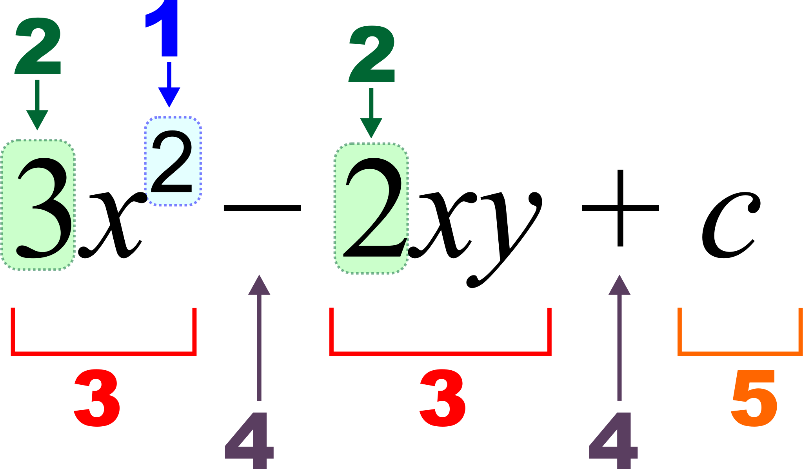

# Elementary algebra
For example, in <b>$$ x+2=5 $$</b> the letter <b>x</b> is unknown, but the law of inverses can be used to discover its value: x=3. 
In <b>$$ E = mc2 $$</b>, the letters <b>E and m are variables</b>, and the letter </b>c is a constant</b>, the speed of light in a vacuum. Algebra gives methods for writing formulas and solving equations that are much clearer and easier than the older method of writing everything out in words.

# Algebraic notation

1 : [Exponent (power)](https://en.wikipedia.org/wiki/Exponentiation) 
2 : [Coefficient](https://en.wikipedia.org/wiki/Coefficient) 
3 : term 
4 : operator
5 : [constant](https://en.wikipedia.org/wiki/Constant_(mathematics))
6 : [x,y : variables](https://en.wikipedia.org/wiki/Variable_(mathematics))

## Variable
Elementary algebra builds on and extends arithmetic by introducing letters called variables to represent general (non-specified) numbers. This is useful for several reasons.
