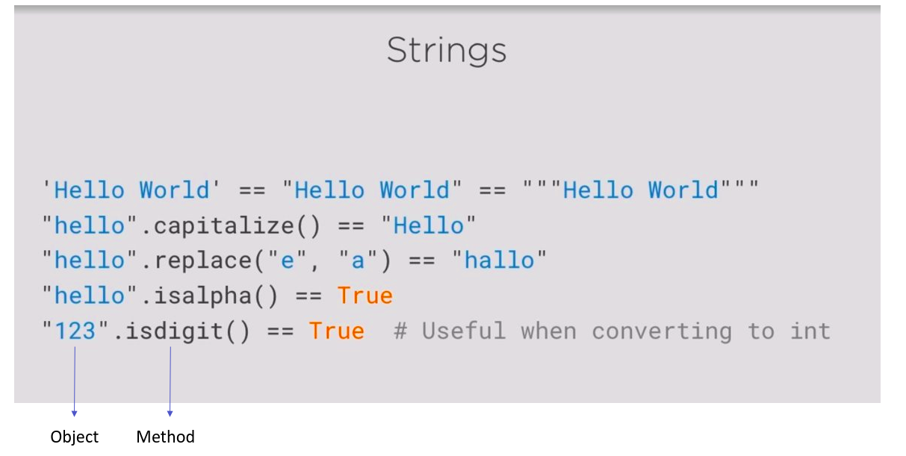

# Python Class from pluralsight

## Working With Python
1. Python
   - Executing Python File
   - Rundimentary REPL

2. pip
   - Install 3rd Party Libraries

3. iPython
   - Robust interactive shell

## Using Python:
1. Automation+
2. Science
3. Desktop Application
4. Android
5. Web
6. Machine Learning

## Types in Python
1. Integers
2. Floats 
3. String



### Examples:
```python
>>> "some, csv, values".split(",")
['some', ' csv', ' values']
```
```python
>>> #String Format Function
>>> print ("Nice to meet you {0}. Your age is {1}".format(name, age))
Nice to meet you Jegathesan. Your age is 27
```
4. Boolean 
5. None == NULL

## If Statements
code:
```python
number = 5
if number == 5 :
    print ("This will execute")
else:
    print ("This will Not Execute")
```
### Truthy and Falsy Values
```python
number = 5
if number:
    print ("Number is not Null")
else:
    print ("This will Not Execute")

number = 0
if number:
    print ("Number is not Null")
else:
    print ("This will Execute")

str = ""
if str:
    print ("This will Execute")
else:
    print ("This will NOT Execute")
```

### Boolen and None
```python
python_course = True
if python_course:
    print ("This will execute")

aliens_found = None
if aliens_found = None
    print("This will Not Execute")
```

### Not if 
```python
number = 5

if number != 5:
    print ("This will NOT Execute")

Python_course = True
if not python_course:
    print("This is will NOT Execute")
```

### Multiple if condition
```python
number = 5
python_course = True
if number == 5 and python_course:
    print ("This will execute")

if number == 17 or python_course:
    print ("This will also execute")
```
### Ternary if statement
```python
a = 1
b = 2
"bigger" if a > b else "smaller"
```
## Lists
When we want hold multiple objects in single variable with different data type.
```python
#Positive Index values
student_names = []
student_names = ["Anu", "Abhi", "Asha"]
                   0       1       2  
                 Index   Index   Index
                
```

```python
#Negative Index Values
student_names = []
student_names = ["Anu", "Abhi", "Asha"]
                  -3      -2      -1  
                 Index   Index   Index
                
```
```python
#List.append at end of list
student_names = ["Anu", "Abhi", "Asha"]
student_names.append("Varsha")
print ("List:", student_names)

#Is Varsha in the list
"Varsha" in student_names

#How many elements in the list
len(student_names)

#Delete obj from the list
del student_names[3] #Varsha is no longer in the list :(

#List slicing 
student_names == ["Anu", "Abhi", "Asha"]
student_names[1:] == ["Abhi", "Asha"]
#Slicing Syntax:
#list[start:End]

```
```
Output:
List: ['Anu', 'Abhi', 'Asha', 'Varsha']
True
4
```

## For Loop

```python
#Define a List
student_list = [1, "Anu", 2, "Abhi", 3, "Asha"]
for name in student_list:
    print ("Obj: {0}".format(name))
```
```
Output console:
Obj: 1
Obj: Anu
Obj: 2
Obj: Abhi
Obj: 3
Obj: Asha
```

## Break
```python
#Example for without Break Statment
#Define a List
student_list = [1, "Anu", 2, "Abhi", 3, "Asha", 4, "Varsha"]

for element in student_list:
    if element == "Abhi"
        print ("Found element !" + element)
    print ("Currently Testing " + element)
```
```python
console Output:
Currently Testing 1
Currently Testing Anu
Currently Testing 2
Found Element Abhi
Currently Testing 3
Currently Testing Asha
Currbently Testing 4
Currently Testing Varsha
```
```python
#Example for with Break Statment
#Define a List
student_list = [1, "Anu", 2, "Abhi", 3, "Asha", 4, "Varsha"]

for element in student_list:
    if element == "Abhi"
        print ("Found element !" + element)
        break
    print ("Currently Testing " + element)
```
```python
console Output:
Currently Testing 1
Currently Testing Anu
Currently Testing 2
Found Element Abhi
```

## continue
```python
#Use case: Want exclude Abhi from the list
#Define a List
student_list = [1, "Anu", 2, "Abhi", 3, "Asha", 4, "Varsha"]

for element in student_list:
    if element == "Abhi"
        continue
        print ("Found element !" + element)
    print ("Currently Testing " + element)
```
```python
console Output:
Currently Testing 1
Currently Testing Anu
Currently Testing 2
Currently Testing 3
Currently Testing Asha
Currbently Testing 4
Currently Testing Varsha
```

## While Loops

```python
x = 0
while x < 10:   
    print ("Count is {0}".format(x))
    x +=1
```

```python
#Infinite Loops
num = 10
while True:
    if num == 42:
        break
    print ("Thank You")
```

## Tutorials - What You can do with Python Loop
### While
A while loop is a programming concept that, when it's implemented, executes a piece of code over and over again while a given condition still holds true.

The above definition also highlights the three components that you need to construct the while loop in Python:

1. The <b>while</b> keyword;
2. A condition that transates to either <b>True</b> or <b>False</b>; And
3. A block of code that you want to execute repeatedly.

Take a look at the following example:
```python
# Take user input
number = 2 

# Condition of the while loop
while number < 5 :  
    # Find the mod of 2
    if number%2 == 0:  
        print("The number "+str(number)+" is even")
    else:
        print("The number "+str(number)+" is odd")

    # Increment `number` by 1
    number = number+1
```

```Python
Console Output:
The number 2 is even
The number 3 is odd
The number 4 is even
```

## For Loop
In contrast to the while loop, there isn't any condition actively involved - you just execute a piece of code repeatedly for a number of times. In other words, while the while loop keeps on executing the block of code contained within it only till the condition is True, the for loop executes the code contained within it only for a specific number of times. This "number of times" is determined by a sequence or an ordered list of things.

1. The <b>for</b> keyword
2. A variable
3. The <b>in</b> keyword
4. The <b>range()</b> function, which is an built-in function in the Python library to create a sequence of numbers (or) list, Dictionaries

```python
# Print "Thank you" 5 times
for number in range(5):
    print("Thank you")
```

Let's consider another example of a for loop, where you make use of two variables to define your control flow:
```Python
languages = ['R', 'Python',  'Scala', 'Java', 'Julia']

for index in range(len(languages)):
   print('Current language:', languages[index])
```

```python
Console Output:
Current language: R
Current language: Python
Current language: Scala
Current language: Java
Current language: Julia
```

## Dictionary
A dictionary in Python is a collection of items accessed by a specific key rather than by index. 

```python
#Define Dictionary
a = {'apple': 'fruit', 'beetroot': 'vegetable', 'cake': 'dessert'}
a['doughnut'] = 'snack'
print(a['apple'])
```
```console
fruit
```

```python
#List of Dictionary
all_students = [
        {"name": "Mark", "student_id":"10"},
        {"name": "Jeff", "student_id":"11"},
]

```
```python
#Accces Dictionary
a = {'apple': 'fruit', 'beetroot': 'vegetable', 'cake': 'venila'}
# Get list of keys
a.keys() == ['cake', 'beetroot', 'apple']

# Get list of Values
a.values() == ['venila', 'vegetable', 'fruit']

# Update the Key
a['apple'] = "orange"

# Delete the Value
del a[fruit]
```

## Exceptions
Take a look at the following example:
```python
#Example without Exception Handler
student = {
    "name": "Jegathesan", 
    "Employee id": 1312,
    "Feedback": None
}
last_name = student["last_name"]

```
```
Console Output
>>> last_name = student["last_name"]
Traceback (most recent call last):
  File "<pyshell#151>", line 1, in <module>
    last_name = student["last_name"]
KeyError: 'last_name'
```

```python
#Example without Exception Handler
student = {
    "name": "Jegathesan", 
    "Employee id": 1312,
    "Feedback": None
}
try:
    last_name = student["last_name"]
except KeyError:
    print ("Error finding last_name")

print ("This code executes!")

```

Take a look at the following example to handle type error:
```python
#Example Exception Handler
student = {
    "name": "Jegathesan", 
    "Employee id": 1312,
    "Feedback": None
}
student["last_name"] = "Nullbyte"

try:
    number_last_name = 3 + "last_name"   
except TypeError:
    print ("I can't add these two together!")

print ("This code executes!")

```

Take a look at the following example to handle unknown error:
```python
#Example Exception Handler
student = {
    "name": "Jegathesan", 
    "Employee id": 1312,
    "Feedback": None
}
student["last_name"] = "Nullbyte"

try:
    number_last_name = 3 + "last_name"   
except Exception as error:
    print ("Unknown Error!")
    print (error)   #Print Error Message

print ("This code executes!")
```
```
Output console
Unknown Error!
unsupported operand type(s) for +: 'int' and 'str'
This code executes!
```

## Other Data Types
Complex<br>
long #Only in Python 2</br>
bytes and bytearray</br>
tuple = (2, 4, 6, "Jegathesan") 
> tuple is like a list. But, Its immutable
#### set and Frozenset
set([2, 3, 4, 2, 5]) == (2, 3, 4, 4) 
> Remove duplicate element

## Functions
You use functions in programming to bundle a set of instructions that you want to use repeatedly or that, because of their complexity, are better self-contained in a sub-program and called when needed. That means that a function is a piece of code written to carry out a specified task. To carry out that specific task, the function might or might not need multiple inputs. When the task is carried out, the function can or can not return one or more values.

There are three types of functions in Python:

1. Built-in functions, such as help() to ask for help, min() to get the minimum value, print() to print an object to the terminal,… You can find an overview with more of these functions here.
2. User-Defined Functions (UDFs), which are functions that users create to help them out; And
3. Anonymous functions, which are also called lambda functions because they are not declared with the standard <b>def</b> keyword.

```python
print ("Hello World")
str(3) == "3"
int ("15") == 15
username = input("Enter your name:")

#print, str, int and input are in-build functions 
```

### Passing Arguments:
```python
def add_student(name, id):
    student_dic = {"Name": name, "Student_ide": id}
    student.append(student_dic)
    
add_student("Mark", 3001)
```

### Default Arguments
```python
def add_student(name, id="3001"):
    student_dic = {"Name": name, "Student_ide": id}
    student.append(student_dic)
    
add_student("Mark")
add_student("Mackus", 3002)
```

### Variable number of arguments
```python
def var_args(name , *args):
    print (name)
    print (args)    

var_args("Jega", 1, 3, True, "Hello", "What's up")
```
```
Output Console:
Jega
(1, 3, True, 'Hello', "What's up")
```

### Nested Function
```python
def factorial(number):

    # Error handling
    if not isinstance(number, int):
        raise TypeError("Sorry. 'number' must be an integer.")
    if not number >= 0:
        raise ValueError("Sorry. 'number' must be zero or positive.")

    def inner_factorial(number):
        if number <= 1:
            return 1
        return number*inner_factorial(number-1)
    return inner_factorial(number)

# Call the outer function.
print(factorial(4))
```

### Credits:
app.pluralsight.com Instructors<br>
datacamp.com<br>
w3schools.com<br>

### License:
MIT


