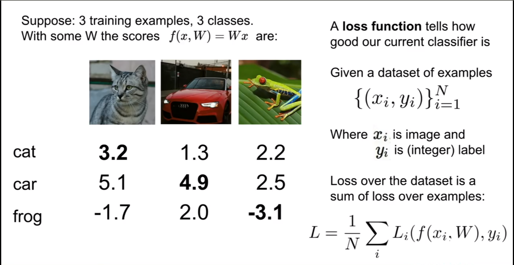
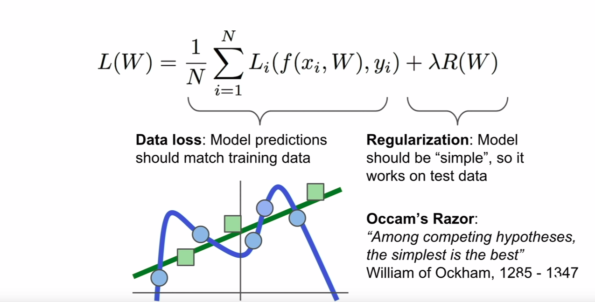

## cs231 - Model 1 - Chapter 2
## Linear classification: Support Vector Machine, Softmax
1. Score Function
2. Loss Function

## Parameterized mapping from images to label scores

Score function that maps the pixel values of an image to confidence scores for each class.

---
$$ \text{training dataset of images  } x_i \in {R}^D \text{. in } x_i \text{ i=1...N and } y_i \in \text{1...K} $$
---
- N - Number of examples - 50,000 Images
- D - Dimension of those images - D = 32 * 32 * 3 = 3072
- K - 10 - Classes (Dog, cat, etc)

<b>Linear classifier:</b> In this module we will start out with arguably the simplest possible function, a linear mapping:

---
$$ f(x_i, W, b) = Wx_i + b $$
---
- x_i = flattened out to a single column vector of shape [D x 1].<br>
- W(Weight) = size [K x D]<br>
- b(bias) = size [K x 1]<br>

<b>Note:</b>
1. Notice also that we think of the input data (xi,yi) as given and fixed, but we have control over the setting of the parameters W, b. Our goal will be to set these in such way that the computed scores match the ground truth labels across the whole training set.
2. An advantage of this approach is that the training data is used to learn the parameters W,b, but once the learning is complete we can discard the entire training set and only keep the learned parameters. That is because a new test image can be simply forwarded through the function and classified based on the computed scores.

## Interpreting a linear classifier:


An example of mapping an image to class scores. For the sake of visualization, we assume the image only has 4 pixels (4 monochrome pixels, we are not considering color channels in this example for brevity), and that we have 3 classes (red (cat), green (dog), blue (ship) class). (Clarification: in particular, the colors here simply indicate 3 classes and are not related to the RGB channels.) We stretch the image pixels into a column and perform matrix multiplication to get the scores for each class. Note that this particular set of weights W is not good at all: the weights assign our cat image a very low cat score. In particular, this set of weights seems convinced that it's looking at a dog.

```python
import numpy as np
W = np.array([[0.2, -0.5, 0.1, 2.0], [1.5, 1.3, 2.1, 0.0], [0.0, 0.25, 0.2, -0.3] ])
x_i = np.array([56, 231, 24, 2])
b = np.array([1.1, 3.2, -1.2])
out = np.dot(W,x_i) + b
```

```bash
output:
array([-96.8 , 437.9 ,  60.75])
```

<b>Image data preprocessing</b> -Perform normalization - Further common preprocessing is to scale each input feature so that its values range from [-1, 1].

### Loss Function or Cost Function
we saw that we don’t have control over the data (xi,yi) (it is fixed and given), but we do have control over these weights and we want to set them so that the predicted class scores are consistent with the ground truth labels in the training data.

Simply, A Loss Functions tells us “how good” our model is at making predictions for a given set of parameters. The cost function has its own curve and its own gradients. The slope of this curve tells us how to update our parameters to make the model more accurate.



That labels values can be 0 to 1 integer.

### Multiclass Support Vector Machine loss (SVM)

$$ \text {SVM “wants” the correct class for each image to a have a score higher than the incorrect classes by some fixed margin} \varDelta $$ 

---
$$ \text {For example, i-th example we are given the pixel of image } x_i \text { and the label} y_i \text{that specific that index of the correct class. The score function takes the pixel and computes the vector } f(x_i, W) \text { of class scores, Which will abbreviate to s. For example, the score for the j-th class is the j-th element } s_j = f(x_i,W)_j . $$

---
$$ L_i = \sum_{j\neq y_i} \max(0, s_j - s_{y_i} + \Delta) $$
---

In the above example, 
```bash
For cat row, 
Li = max(0, 5.1 - 3.2 + 1) + max (0, -1.7 - 3,.2 + 1)
   = max(0, 2.9) + max (0, -3.9)
   = 2.9 + 0
Losses   = 2.9
```

```bash
For car row,
Li = max(0, 1.3 - 4.9 + 1) + max (0, 2.0 - 4.9 + 1)
   = max(0, -2.6) + max (0, -1.9)
   = 0 + 0
Losses   = 0
```
 Treshold at zero max(0,−) function is often called the hinge loss.The loss function quantifies our unhappiness with predictions on the training set.
 

The Multiclass Support Vector Machine "wants" the score of the correct class to be higher than all other scores by at least a margin of delta. If any class has a score inside the red region (or higher), then there will be accumulated loss. Otherwise the loss will be zero. Our objective will be to find the weights that will simultaneously satisfy this constraint for all examples in the training data and give a total loss that is as low as possible.

```python
def L_i_vectorized(x, y, W):
  """
  A faster half-vectorized implementation. half-vectorized
  refers to the fact that for a single example the implementation contains
  no for loops, but there is still one loop over the examples (outside this function)
  """
  delta = 1.0
  scores = W.dot(x)
  # compute the margins for all classes in one vector operation
  margins = np.maximum(0, scores - scores[y] + delta)
  # on y-th position scores[y] - scores[y] canceled and gave delta. We want
  # to ignore the y-th position and only consider margin on max wrong class
  margins[y] = 0
  loss_i = np.sum(margins)
  return loss_i
```

Really in practise, We dont actually care that much about fitting the training Data, the whole point of machine leanring is that we use the training data to find some classifer and then apply that on test data. We do not really care about the training performance. We really care about the performance of the classifier on test data.

### Regularization:



We wish to encode some preference for a certain set of weights W over others to remove this ambiguity. We can do so by extending the loss function with a regularization penalty R(W). The most common regularization penalty is the L2 norm that discourages large weights through an elementwise quadratic penalty over all parameters:

$$ R(W) = \sum_k\sum_l W_{k,l}^2 $$

In the expression above, we are summing up all the squared elements of W. Notice that the regularization function is not a function of the data, it is only based on the weights. Including the regularization penalty completes the full Multiclass Support Vector Machine loss, which is made up of two components: the data loss (which is the average loss Li over all examples) and the regularization loss. That is, the full Multiclass SVM loss becomes:

---

$$ L =  \underbrace{ \frac{1}{N} \sum_i L_i }_\text{data loss} + \underbrace{ \lambda R(W) }_\text{regularization loss} $$

---

Or expanding this out in its full form:

---
$$ L = \frac{1}{N} \sum_i \sum_{j\neq y_i} \left[ \max(0, f(x_i; W)_j - f(x_i; W)_{y_i} + \Delta) \right] + \lambda \sum_k\sum_l W_{k,l}^2 $$

---