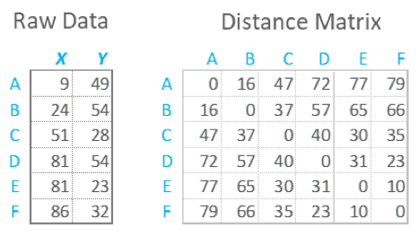

What is distance Matrix?
A distance matrix is a table that shows the distance between pairs of objects. For example, in the table below we can see a distance of 16 between A and B, of 47 between A and C, and so on. By definition, an object’s distance from itself,which is shown in the main diagonal of the table, is 0. Distance matrices are sometimes called dissimilarity matrices.

How to create a distance matrix?
a distance matrix is computed from a raw data table. In the example below, we can use high school math (Pythagoras) to work out that the distance between A and B is
 $$\sqrt{(24 - 9)^2 + (54 -  49)^2} \approx 15.81 = 16$$ 

 Raw Data:
 
 