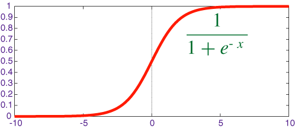

## Epoch vs Batch Size vs Iterations
### Epoch:
One Epoch is when an ENTIRE dataset is passed forward and backward through the neural network only ONCE.

### Batch Size:
Total number of training examples present in a single batch. We can’t pass the entire dataset into the neural net at once. So, you divide dataset into Number of <b>Batches</b> or <b>sets</b> or <b>parts.</b>

### Iterations: 
Iterations is the number of batches needed to complete one epoch.

For example,  
We can divide the dataset of 2000 examples into batches of 500 then it will take a 4 iterations to complete 1 epoch.

## Parameters and Hyperparameter
A machine learning model is the definition of a mathematical formula with a number of <b>parameters</b> that need to be learned from the data. This is done by training a model with existing data, we are able to fit the model parameters.

Hyperparameters are the <b>variables</b> which determines the <b>network structure</b>(Eg: Number of Hidden Units) and the variables which determine <b>how the network is trained</b>(Eg: Learning Rate).

Hyperparameters are set before training(before optimizing the weights and bias).

### Hyperparameters related to Network structure:
1. Number of Hidden Layers and units:
   1. Hidden layers are the layers between input layer and output layer. Many hidden units within a layer with regularization techniques can increase accuracy. Smaller number of units may cause underfitting. 

   2. <b>Dropout</b> is regularization technique to avoid overfitting (increase the validation accuracy) thus increasing the generalizing power.

2. Network Weight Initialization:
   1. Ideally, it may be better to use different weight initialization schemes according to the activation function used on each layer.
   
   2. Mostly uniform distribution is used.
   <b>Activation function</b>

   
   
   Sigmoid is used in the output layer while making binary predictions. Softmax is used in the output layer while making multi-class predictions.

### Hyperparameters related to Training Algorithm
1. Learning Rate:
   
   
   
   1. The learning rate defines how quickly a network updates its parameters.
   2. Low learning rate slows down the learning process but converges smoothly. Larger learning rate speeds up the learning but may not converge.
   3. Usually a decaying Learning rate is preferred.
2. Momentum
   1. Momentum helps to know the direction of the next step with the knowledge of the previous steps. It helps to prevent oscillations. A typical choice of momentum is between 0.5 to 0.9.
3. Number of epochs
   1. Number of epochs is the number of times the whole training data is shown to the network while training.
    Increase the number of epochs until the validation accuracy starts decreasing even when training accuracy is increasing(overfitting).
4. Batch size
   1. Mini batch size is the number of sub samples given to the network after which parameter update happens. A good default for batch size might be 32. Also try 32, 64, 128, 256, and so on.    
   
   Ref: https://towardsdatascience.com/what-are-hyperparameters-and-how-to-tune-the-hyperparameters-in-a-deep-neural-network-d0604917584a