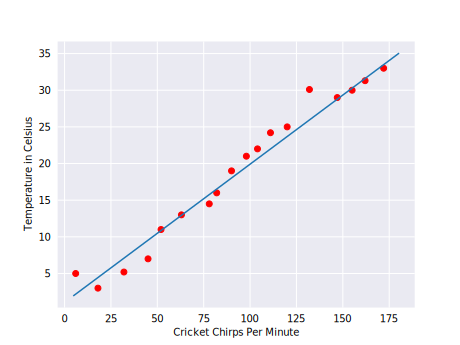

# Machine Leaning crash course by Google

## 1. Intro to ML
ML changes the way you think about a problem.

## 2. Framing
How to frame a task as ML problem. 

**What is supervised ML?**
ML systems learn how to combine input to produce useful predictions on never-before-seen data.


1. **Example Data** - DataSet.
2. **Labeled Example** has {features, label}: (x, y) - Used to train the model. 
3. **Unlabeled Example** has {features, ? }: (x, ?) - Used for making predictions on new data.
4. **Model** maps example to predicted labels: y' - Defined by internal param whcich are learned.

For example, 
An example is a particular instance of data, x.We break examples into two categories:
1. Labeled examples
2. Unlabeled examples

 labeled example includes both feature(s) and the label. That is:
 ```python
   labeled examples: {features, label}: (x, y)
 ```
 | HousingMedianAge(feature) | TotalRooms (feature)|MedianHouseValue(label) |
 |----------|:-------------:|------ |
 | 15 | 25456 | 66900|
 | 19 | 7650 | 80100 |
 | 17 | 720 | 85700 |
 
 An unlabeled example contains features but not the label. That is:
 ```python
 unlabeled examples: {features, ?}: (x, ?)
 ```
 | HousingMedianAge(feature) | TotalRooms (feature)|
 |----------|:-------------:|
 | 67 | 902726 |
 | 28 | 89797  |
 | 80 | 776242 |
 
 **Model**:
1. A model defines the relationship between **features and label**. Training means creating or learning the model. That is, you show the model labeled examples and enable the model to gradually learn the relationships between features and label.

2. Inference means applying the **trained model to unlabeled examples**. That is, you use the trained model to make useful predictions (y'). For example, during inference, you can predict medianHouseValue for new unlabeled examples.

**Regression vs. classification**:
A regression model predicts **continuous values**.
* What is the value of a house in California?
* What is the probability that a user will click on this ad?

A classification model predicts **discrete values**.
* Is a given email message spam or not spam?
* Is this an image of a dog, a cat, or a hamster?

## 3. Descending into ML:

**Math Basics:**
What is variable?
a linear equation is an equation that may be put in the form,
$$ {a_1x_1 + a_2x_2 + ... + a_nx_n + b} = 0 $$

Where x1,x2..xn are the variable and b,a1,a2..an are the Coefficient and b is the bias.



We could write it down like this,
$$ y = mx + b $$

Where,

 * y is the temperature in Celsius—the value we're trying to predict.
 * m is the slope of the line.
 * x is the number of chirps per minute—the value of our input feature.
 * b is the y-intercept.

By convention in machine learning, you'll write the equation for a model slightly differently:
$$ y' = b + w_1x_1 $$

Where,

* y' is the predicted label (a desired output).
* b  is the bias (the y-intercept), sometimes referred to as w0.
* w1 is the weight of feature 1. Weight is the same concept as the "slope" m in the traditional equation of a line.
* x1 is the feature(input).

Although this model uses only one feature, a more sophisticated model might rely on multiple features, each having a separate weight (w1, w2, etc.). For example, a model that relies on three features might look as follows:

$$ y' = b + w_1x_1 + w_2x_2 + w_3x_3 $$

**Training and Loss:**
Training a model simply means learning (determining) good values for all the weights and the bias from labeled examples. In supervised learning, a machine learning algorithm builds a model by examining many examples and attempting to find a model that minimizes loss; this process is called empirical risk minimization.

Loss is the penalty for a bad prediction. That is, loss is a number indicating how bad the model's prediction was on a single example. If the model's prediction is perfect, the loss is zero; otherwise, the loss is greater. The goal of training a model is to find a set of weights and biases that have low loss, on average, across all examples. For example, Figure 3 shows a high loss model on the left and a low loss model on the right. Note the following about the figure:

* The arrows represent loss.
* The lines represent predictions.

### Squared loss: a popular loss function:
The linear regression models we'll examine here use a loss function called squared loss (also known as L2 loss). The squared loss for a single example is as follows:

```python
  = the square of the difference between the label and the prediction
  = (observation - prediction(x))2
  = (y - y')2
```

Mean square error (MSE) is the average squared loss per example over the whole dataset. To calculate MSE, sum up all the squared losses for individual examples and then divide by the number of examples:

$$ MSE = \frac{1}{N} \sum_{(x,y)\in D} (y - prediction(x))^2 $$

Where,
* (x, y) is an example in which,
  * x is the set of features (for example, chirps/minute, age, gender) that the model uses to make predictions.
  * y is the example's label (for example, temperature).
* prediction(x) is a function of the weights and bias in combination with the set of features x.
* D is a data set containing many labeled examples, which are(x, y) pairs.
* N is the number of examples in D.