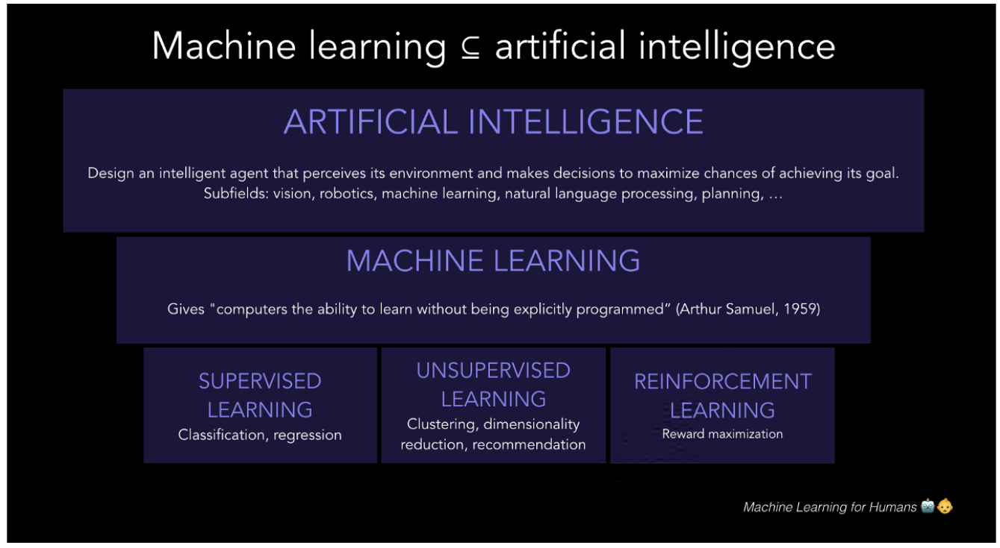

# Machine Learning For Humans by Vishal Maini Notes
## Part 1:
### Introduction:


## Part 2:
### Supervised Learning:
The two tasks of supervised learning: regression and classification.
In supervised learning problems, we start with a data set containing training examples with associated correct labels.

let’s examine the problem of <b>predicting annual income</b> based on the number of years of higher education someone has completed. Expressed more formally, we’d like to build a model that approximates the relationship f between the number of years of higher education X and corresponding annual income Y.

```code
X (input) = years of higher education
Y (output) = annual income
f = function describing the relationship between X and Y
ϵ (epsilon) = random error term (positive or negative) with mean zero

```

In supervised learning, the machine attempts to learn the relationship between income and education from scratch, by running labeled training data through a learning algorithm.
This learned function can be used to estimate the income of people whose income Y is unknown, as long as we have years of education X as inputs. In other words, we can apply our model to the unlabeled test data to estimate Y.

<b>The two tasks of supervised learning: regression and classification</b>
```python
Regression: predict a continuous numerical value. How much will that house sell for?
Classification: assign a label. Is this a picture of a cat or a dog?
```


