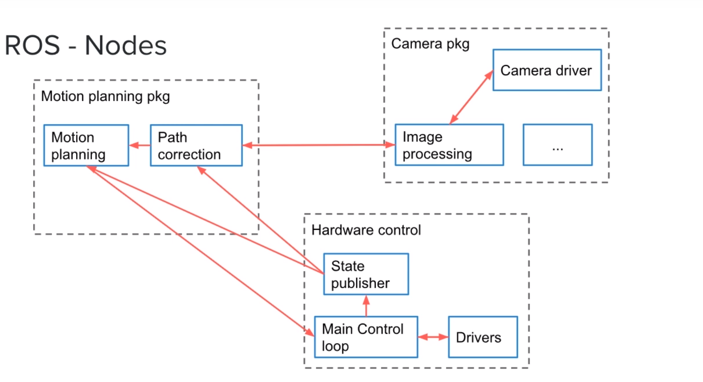

# Ros - Robot Operating System

## 0.1 ROS Installation on Ubuntu 16.04 LTS

Follow the lecture, instructions are the same. But use the commands from this page instead : http://wiki.ros.org/kinetic/Installation/Ubuntu

## 1.0 Creating a catkin workspace

```bash
cd ~/Desktop/
mkdir catkin_ws/
cd catkin_ws/
mkdir src
catkin_make
```

Now, We can see that build and devel folder created by catkin_make. And, Can see CMakeLists.txt symbolic link too inside src folder.

### Setup ROS environment

```bash
cd devel
source setup.bash
```

or add it in .bashrc file,

```bash
vim ~/.bashrc
source /home/nullbyte/Desktop/catkin_ws/devel/setup.bash
```

### 1.1 ROS - Packages

To run a code for us will first need to create a packages will allow us to separate the code into re-usable blocks. So, the development and maintance of the application will be easier.

To create a simple pakage,

```bash
cd src
catkin_create_pkg my_robot roscpp rospy std_msgs
```

```bash
output:
Created file my_robot/CMakeLists.txt
Created file my_robot/package.xml
Created folder my_robot/include/my_robot
Created folder my_robot/src
Successfully created files in /home/nullbyte/Desktop/catkin_ws/src/my_robot. Please adjust the values in package.xml.
```

Compile a new a package,

```bash
cd ~/Desktop/catkin_ws/
catkin_make
```

```bash
console output:
nullbyte@visteonPune:~/Desktop/catkin_ws$ catkin_make
Base path: /home/nullbyte/Desktop/catkin_ws
Source space: /home/nullbyte/Desktop/catkin_ws/src
Build space: /home/nullbyte/Desktop/catkin_ws/build
Devel space: /home/nullbyte/Desktop/catkin_ws/devel
Install space: /home/nullbyte/Desktop/catkin_ws/install
####
#### Running command: "cmake /home/nullbyte/Desktop/catkin_ws/src -DCATKIN_DEVEL_PREFIX=/home/nullbyte/Desktop/catkin_ws/devel -DCMAKE_INSTALL_PREFIX=/home/nullbyte/Desktonullbyte@visteonPune:~/Desktop/catkin_ws$ catkin_make
Base path: /home/nullbyte/Desktop/catkin_ws
Source space: /home/nullbyte/Desktop/catkin_ws/src
Build space: /home/nullbyte/Desktop/catkin_ws/build
Devel space: /home/nullbyte/Desktop/catkin_ws/devel
Install space: /home/nullbyte/Desktop/catkin_ws/install
####
#### Running command: "cmake /home/nullbyte/Desktop/catkin_ws/src -DCATKIN_DEVEL_PREFIX=/home/nullbyte/Desktop/catkin_ws/devel -DCMAKE_INSTALL_PREFIX=/home/nullbyte/Desktop/catkin_ws/install -G Unix Makefiles" in "/home/nullbyte/Desktop/catkin_ws/build"
####
-- Using CATKIN_DEVEL_PREFIX: /home/nullbyte/Desktop/catkin_ws/devel
-- Using CMAKE_PREFIX_PATH: /home/nullbyte/Desktop/catkin_ws/devel;/opt/ros/kinetic
-- This workspace overlays: /home/nullbyte/Desktop/catkin_ws/devel;/opt/ros/kinetic
-- Using PYTHON_EXECUTABLE: /usr/bin/python
-- Using Debian Python package layout
-- Using empy: /usr/bin/empy
-- Using CATKIN_ENABLE_TESTING: ON
-- Call enable_testing()
-- Using CATKIN_TEST_RESULTS_DIR: /home/nullbyte/Desktop/catkin_ws/build/test_results
-- Found gmock sources under '/usr/src/gmock': gmock will be built
-- Found gtest sources under '/usr/src/gmock': gtests will be built
-- Using Python nosetests: /usr/bin/nosetests-2.7
-- catkin 0.7.14
-- BUILD_SHARED_LIBS is on
-- ~~~~~~~~~~~~~~~~~~~~~~~~~~~~~~~~~~~~~~~~~~~~~~~~~
-- ~~  traversing 1 packages in topological order:
-- ~~  - my_robot
-- ~~~~~~~~~~~~~~~~~~~~~~~~~~~~~~~~~~~~~~~~~~~~~~~~~
-- +++ processing catkin package: 'my_robot'
-- ==> add_subdirectory(my_robot)
-- Configuring done
-- Generating done
-- Build files have been written to: /home/nullbyte/Desktop/catkin_ws/build
####
#### Running command: "make -j4 -l4" in "/home/nullbyte/Desktop/catkin_ws/build"
####
p/catkin_ws/install -G Unix Makefiles" in "/home/nullbyte/Desktop/catkin_ws/build"
####
-- Using CATKIN_DEVEL_PREFIX: /home/nullbyte/Desktop/catkin_ws/devel
-- Using CMAKE_PREFIX_PATH: /home/nullbyte/Desktop/catkin_ws/devel;/opt/ros/kinetic
-- This workspace overlays: /home/nullbyte/Desktop/catkin_ws/devel;/opt/ros/kinetic
-- Using PYTHON_EXECUTABLE: /usr/bin/python
-- Using Debian Python package layout
-- Using empy: /usr/bin/empy
-- Using CATKIN_ENABLE_TESTING: ON
-- Call enable_testing()
-- Using CATKIN_TEST_RESULTS_DIR: /home/nullbyte/Desktop/catkin_ws/build/test_results
-- Found gmock sources under '/usr/src/gmock': gmock will be built
-- Found gtest sources under '/usr/src/gmock': gtests will be built
-- Using Python nosetests: /usr/bin/nosetests-2.7
-- catkin 0.7.14
-- BUILD_SHARED_LIBS is on
-- ~~~~~~~~~~~~~~~~~~~~~~~~~~~~~~~~~~~~~~~~~~~~~~~~~
-- ~~  traversing 1 packages in topological order:
-- ~~  - my_robot
-- ~~~~~~~~~~~~~~~~~~~~~~~~~~~~~~~~~~~~~~~~~~~~~~~~~
-- +++ processing catkin package: 'my_robot'
-- ==> add_subdirectory(my_robot)
-- Configuring done
-- Generating done
-- Build files have been written to: /home/nullbyte/Desktop/catkin_ws/build
####
#### Running command: "make -j4 -l4" in "/home/nullbyte/Desktop/catkin_ws/build"
####
```

## 2.0 ROS - Nodes

Its an executable that uses ROS to comunicate with other Nodes. In another word, An executable program running inside our Robot applicaton. Our application might contain many Nodes which will b put into pakages. Then, Node will communicate each other.



Let say example, Camera pakage has Camera driver node, Image processing node and etc. And, These nodes will communicate through RASC Communication.

RASC Communication will be used between Pakage too.

Overview of ROS - Nodes:

- Processes that perform computation
- Combined into a graph
- Communicate with each other through topics, services and parameter server.

Benefits:

- Reduce code complexity
- Fault tolerance
- Can be written in Python, C++, ..